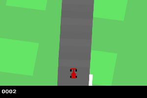
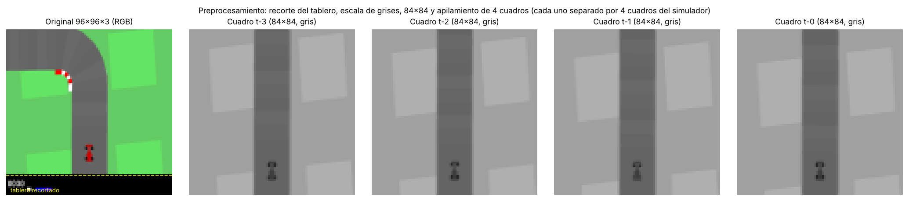
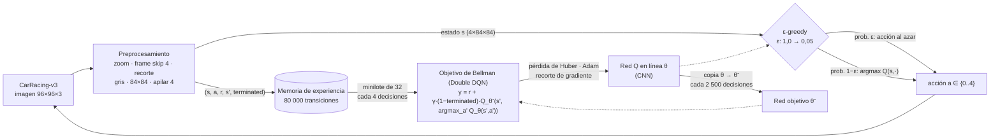
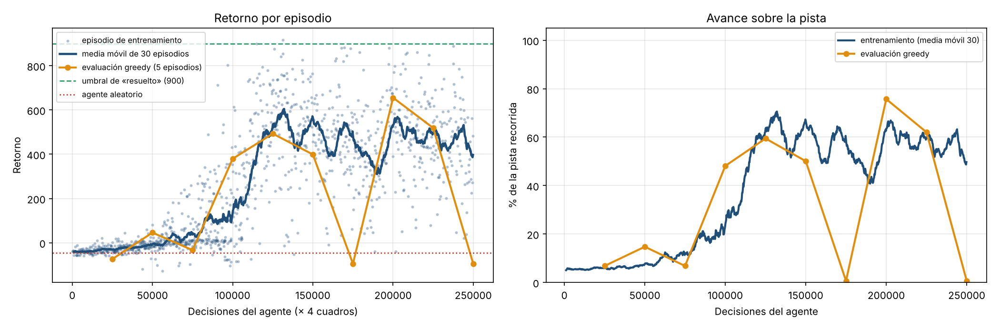
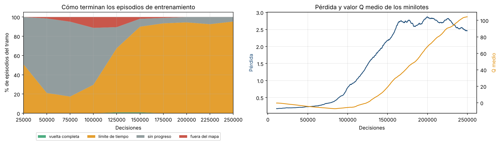
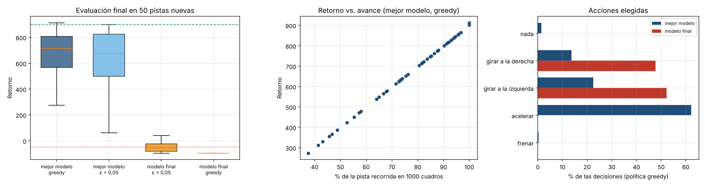
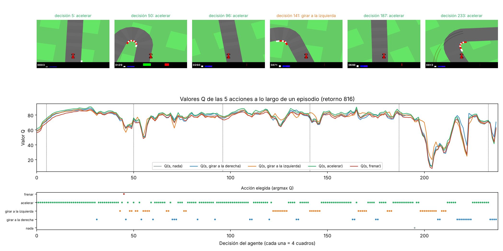

# Taller 2 · Deep Q-Network para CarRacing-v3 desde píxeles

**Simulación y Aprendizaje por Refuerzo · Maestría · Universidad de La Sabana · Grupo 10**

<p align="center"></p>

> **Resultado en una línea:** un DQN (Double DQN + red convolucional de Mnih et al., 2015) entrenado desde cero con 1 M de cuadros en CPU conduce en **CarRacing-v3 (acciones discretas)** con un retorno de **665 ± 172 en 50 pistas nuevas** (agente aleatorio: −46), recorre el **77 %** de la pista sin salirse nunca del mapa y supera 700 puntos en el 54 % de las pistas. No alcanza el umbral de 900 porque no completa la vuelta en los 1000 cuadros disponibles; además, el modelo final colapsó (queda inmóvil) y se entrega el mejor punto de control.


**Integrantes y roles** (detalle en [`GUIA_EQUIPO.md`](GUIA_EQUIPO.md)):

| Rol | Integrante |
|---|---|
| 1 · Integración del repositorio | Diego Ríos |
| 2 · Red neuronal e hiperparámetros | Nataly Valbuena |
| 3 · Ambiente: acciones, observaciones y recompensas | _por asignar_ |
| 4 · Flujo de entrenamiento y particularidades | _por asignar_ |
| 5 · Experimentos y reproducibilidad | _por asignar_ |
| 6 · Resultados | _por asignar_ |
| 7 · Reflexiones y control de calidad | _por asignar_ |

---

## Contenido
1. [Cómo ejecutar](#1-cómo-ejecutar)
2. [El ambiente: acciones, observaciones y recompensas](#2-el-ambiente-acciones-observaciones-y-recompensas)
3. [Flujo lógico del entrenamiento](#3-flujo-lógico-del-entrenamiento)
4. [Particularidades del ambiente](#4-particularidades-del-ambiente)
5. [Red neuronal e hiperparámetros](#5-red-neuronal-e-hiperparámetros)
6. [Resultados del entrenamiento](#6-resultados-del-entrenamiento)
7. [Reflexión sobre los resultados](#7-reflexión-sobre-los-resultados)
8. [Reflexión sobre lo que más costó](#8-reflexión-sobre-lo-que-más-costó)
9. [Referencias](#9-referencias)

---

## 1. Cómo ejecutar

El proyecto usa [`uv`](https://docs.astral.sh/uv/) para el entorno (dependencias en `pyproject.toml`, versiones fijadas en `uv.lock`) y [MLflow](https://mlflow.org/) para registrar cada experimento.

```bash
git clone https://github.com/dialrigo/taller2-dqn-carracing.git
cd taller2-dqn-carracing
uv sync                                                    # crea el entorno e instala dependencias

uv run python scripts/explorar_ambiente.py                 # espacios, preprocesamiento y agente aleatorio
uv run python scripts/resumen_red.py                       # arquitectura de la red con dimensiones reales
uv run python -m carracing_dqn.train                       # entrenamiento completo (usa GPU si existe)
uv run python -m carracing_dqn.train --pasos 3000 --nombre prueba   # verificación rápida (~3 min)
uv run python -m carracing_dqn.train --reanudar            # retoma un entrenamiento interrumpido
uv run python -m carracing_dqn.evaluate                    # evaluación en 50 pistas nuevas + GIF
uv run python -m carracing_dqn.plots                       # figuras de docs/figuras
uv run mlflow ui --backend-store-uri sqlite:///mlflow.db   # tablero de experimentos en http://127.0.0.1:5000
```

Sin instalar nada: [`notebooks/colab_carracing_dqn.ipynb`](notebooks/colab_carracing_dqn.ipynb) ejecuta lo mismo en Google Colab con GPU.

```
├── configs/dqn_carracing.yaml     # única fuente de hiperparámetros
├── src/carracing_dqn/
│   ├── envs.py                    # ambiente y cadena de preprocesamiento (wrappers)
│   ├── model.py                   # red Q convolucional
│   ├── replay.py                  # memoria de experiencia en uint8 (en disco, reanudable)
│   ├── agent.py                   # ε-greedy, red objetivo, actualización de Bellman (Double DQN)
│   ├── train.py                   # ciclo de entrenamiento + MLflow + puntos de control
│   ├── evaluate.py                # evaluación final, visualización de la política y GIF
│   └── plots.py                   # figuras de resultados
├── scripts/                       # exploración del ambiente y resumen de la red
├── notebooks/                     # versión para Google Colab
├── results/                       # registros por episodio, evaluaciones y métricas finales
├── models/                        # modelo entregado (mejor punto de control) y modelo final
└── docs/                          # figuras y GIF del README
```

---

## 2. El ambiente: acciones, observaciones y recompensas

`CarRacing-v3` (familia Box2D de Gymnasium) es una carrera vista desde arriba: el agente controla un auto y debe recorrer una pista que **se genera al azar en cada episodio**. Es el único ambiente de control clásico de Gymnasium cuya observación es una **imagen**, lo que obliga a aprender a «ver» la pista con una red convolucional. Se usa en su versión de **acciones discretas** (`continuous=False`), que es la que admite DQN.

### 2.1 Observaciones

| | Ambiente original | Lo que recibe la red (tras el preprocesamiento) |
|---|---|---|
| Tipo | `Box(0, 255, (96, 96, 3), uint8)` | `Box(0, 255, (4, 84, 84), uint8)` |
| Contenido | Imagen RGB de la cámara cenital + tablero inferior (velocidad, ABS, giroscopio, volante, puntaje) | 4 cuadros consecutivos en escala de grises, sin tablero |
| Rango | enteros 0–255 | enteros 0–255 (se dividen por 255 dentro de la red) |



**Preprocesamiento y su justificación** (`src/carracing_dqn/envs.py`):

| Paso | Qué hace | Por qué |
|---|---|---|
| Saltar zoom inicial | Avanza 50 cuadros con la acción «nada» al reiniciar | Cada episodio arranca con un zoom de cámara en el que la imagen cambia sin que el agente controle nada; la red no debe aprender de esos cuadros. |
| *Frame skip* = 4 | Repite cada acción 4 cuadros y suma las recompensas | Dos cuadros seguidos son casi idénticos (50 FPS). Decidir cada 4 cuadros divide el costo por 4 y hace que cada acción tenga un efecto visible. |
| Recorte del tablero | Elimina las 12 filas inferiores (96 → 84 filas) | El tablero no es pista y muestra el **puntaje**: la red podría correlacionar ese número con el retorno en lugar de aprender a conducir. |
| Escala de grises | RGB → 1 canal | Pista (gris), pasto (verde) y bordes (rojo/blanco) se distinguen por intensidad; el color triplica la entrada sin aportar información útil. |
| 84 × 84 | Redimensiona con interpolación por área | Tamaño estándar de la arquitectura de Mnih et al. (2015); las dimensiones de las convoluciones quedan enteras (20 → 9 → 7). |
| **Apilar 4 cuadros** | El estado son los 4 últimos cuadros procesados | **Una sola imagen no es un estado markoviano**: muestra dónde está el auto, pero no hacia dónde ni qué tan rápido va. Con 4 cuadros (que abarcan 16 cuadros del simulador) la red infiere velocidad, dirección y giro, como se explicó en clase para los juegos de Atari. |

### 2.2 Acciones

`Discrete(5)` (dtype `int64`):

| Acción | Efecto |
|---|---|
| 0 | nada (el auto rueda por inercia) |
| 1 | girar a la derecha |
| 2 | girar a la izquierda |
| 3 | acelerar |
| 4 | frenar |

No se puede acelerar y girar en la misma acción: el agente debe alternar decisiones, lo que hace más difícil tomar curvas rápidas que en la versión continua.

### 2.3 Recompensas

- **−0,1 por cada cuadro** que pasa (−0,4 por decisión con *frame skip* 4): presión permanente para avanzar.
- **+1000/N por cada baldosa nueva** de la pista que el auto pisa, donde N es el número de baldosas de esa pista (≈ 300, por ejemplo 319 con la semilla 0; es decir ≈ 3 puntos por baldosa). **Una baldosa solo paga la primera vez.**
- **−100** si el auto sale del área de juego.
- Recorrer toda la pista en *k* cuadros da 1000 − 0,1·*k*. El ambiente se considera **resuelto con 900 puntos** de media (`spec.reward_threshold = 900`), es decir, completar la vuelta en menos de 1000 cuadros.

### 2.4 Terminación del episodio

| Condición | Tipo | Recompensa |
|---|---|---|
| Se visitan todas las baldosas (vuelta completa) | `terminated` | la acumulada |
| El auto sale del área de juego | `terminated` | −100 |
| Se alcanzan 1000 cuadros (≈ 238 decisiones tras el zoom) | `truncated` (límite de tiempo) | — |
| **Solo en entrenamiento:** 100 decisiones seguidas sin recompensa positiva | `truncated` (corte propio) | — |

---

## 3. Flujo lógico del entrenamiento



> El Rol 4 reemplaza o complementa este diagrama con un esquema propio dibujado a mano (`docs/figuras/diagrama_dqn_propio.png`).

**Pseudocódigo** (implementado en `src/carracing_dqn/train.py` y `agent.py`):

```
inicializar Q_θ (CNN) con pesos aleatorios;  Q_θ⁻ ← Q_θ;  memoria D vacía (80 000)
para paso = 1 … 250 000 decisiones:
    ε ← decaimiento lineal 1,0 → 0,05 durante 100 000 decisiones
    a ← aleatoria si paso ≤ 10 000 (llenado de la memoria); si no, ε-greedy sobre Q_θ(s, ·)
    ejecutar a durante 4 cuadros → s', r (suma), terminated, truncated
    guardar (s, a, r, s', terminated) en D                         # truncated NO se guarda como fin
    cada 4 decisiones:
        muestrear 32 transiciones de D
        a* ← argmax_a' Q_θ(s', a')                                  # la red en línea elige
        y  ← r + 0,99 · (1 − terminated) · Q_θ⁻(s', a*)             # la red objetivo evalúa
        minimizar Huber(Q_θ(s, a), y) con Adam;  ‖∇‖ ≤ 10
    cada 2 500 decisiones:  θ⁻ ← θ
    cada 25 000 decisiones: evaluar la política greedy en 5 pistas fijas y guardar el mejor modelo
    cada 5 000 decisiones:  punto de control (red, optimizador y memoria en disco) para reanudar
```

**Función de cada componente de DQN:**

- **Memoria de experiencia.** Los cuadros consecutivos de una vuelta están muy correlacionados; entrenar con ellos en orden violaría el supuesto de datos independientes del descenso de gradiente y haría que la red olvidara las curvas vistas hace un minuto. Muestrear al azar de 80 000 transiciones rompe esa correlación y reutiliza cada experiencia unas 2 veces.
- **ε-greedy.** Al inicio el agente no sabe que acelerar sobre la pista paga; la exploración aleatoria genera esas primeras experiencias. ε baja de 1 a 0,05 en 100 000 decisiones y se mantiene en 0,05 para seguir corrigiendo errores.
- **Red objetivo.** Si el objetivo *y* se calculara con la misma red que se actualiza, cada paso de gradiente moverían también el objetivo y el valor Q oscilaría. La copia congelada se actualiza cada 2 500 decisiones (625 pasos de gradiente).
- **Actualización de Bellman con Double DQN.** Q(s, a) se ajusta hacia r + γ·Q(s′, a*). En Double DQN la red en línea elige a* y la red objetivo lo evalúa, lo que reduce la sobreestimación del operador máximo (van Hasselt et al., 2016).

---

## 4. Particularidades del ambiente

| Particularidad | Por qué importa | Cómo se abordó |
|---|---|---|
| **Observación en píxeles** | El estado no son variables físicas sino una imagen; el agente debe aprender a reconocer la pista. | Red convolucional y preprocesamiento (sección 2.1). |
| **Una imagen no es markoviana** | Sin historia no se sabe la velocidad ni el sentido del giro. | Apilar 4 cuadros. |
| **Pista distinta en cada episodio** | No se puede memorizar un recorrido: hay que generalizar a curvas nuevas. | Evaluación en 50 pistas que nunca se usaron en el entrenamiento. |
| **Zoom de cámara al inicio** | Los primeros ~50 cuadros son una transición visual sin control. | Se saltan al reiniciar. |
| **Recompensa por baldosa nueva, una sola vez** | Volver por la pista ya recorrida no paga; quedarse quieto cuesta −0,1 por cuadro. | Corte del episodio de entrenamiento tras 100 decisiones sin recompensa positiva: evita llenar la memoria con el auto detenido o girando en el pasto. |
| **El corte propio no es un fin real** | Si se tratara como terminal, el agente aprendería que detenerse «acaba» el episodio sin costo. | Se marca como `truncated`; el objetivo de Bellman sigue estimando el futuro. La evaluación usa el ambiente sin corte. |
| **Límite de 1000 cuadros** | Con el zoom saltado quedan ≈ 238 decisiones; para resolver hay que ir rápido. | Se reporta el % de pista recorrida además del retorno. |
| **Acciones exclusivas** | No se puede acelerar y girar a la vez. | El agente aprende a alternar «acelerar» y «girar»; se analiza la distribución de acciones (sección 6.3). |
| **Costo de simulación** | Box2D + renderizado: ≈ 125 cuadros/s en CPU. | *Frame skip* 4; memoria en disco y puntos de control para reanudar. |

---

## 5. Red neuronal e hiperparámetros

### 5.1 Arquitectura

Arquitectura de la DQN de Mnih et al. (2015), salida reducida a 5 acciones (`src/carracing_dqn/model.py`; verificar con `uv run python scripts/resumen_red.py`):

| Capa | Configuración | Salida (C × H × W) | Parámetros |
|---|---|---|---|
| Entrada | 4 cuadros 84×84, uint8 → ÷255 | 4 × 84 × 84 | 0 |
| Conv 1 | 32 filtros, *kernel* 8×8, *stride* 4, ReLU | 32 × 20 × 20 | 8 224 |
| Conv 2 | 64 filtros, *kernel* 4×4, *stride* 2, ReLU | 64 × 9 × 9 | 32 832 |
| Conv 3 | 64 filtros, *kernel* 3×3, *stride* 1, ReLU | 64 × 7 × 7 | 36 928 |
| Aplanar | — | 3 136 | 0 |
| Densa | 3 136 → 512, ReLU | 512 | 1 606 144 |
| Salida | 512 → 5, lineal | 5 = Q(s, a) por acción | 2 565 |
| **Total** | | | **1 686 693** |

Dimensión de salida de cada convolución: ⌊(entrada − kernel)/stride⌋ + 1 → (84 − 8)/4 + 1 = 20; (20 − 4)/2 + 1 = 9; (9 − 3)/1 + 1 = 7.

**Justificación del diseño:**
- **Convoluciones** porque la entrada es una imagen: comparten pesos por posición y detectan bordes de la pista y la posición del auto donde sea que aparezcan.
- **Strides grandes al inicio (8×8, stride 4)** reducen rápido la resolución: el detalle fino de 84×84 no es necesario para decidir, y se reduce el costo.
- **Los 4 cuadros entran como 4 canales** de la primera convolución: la red compara cuadros consecutivos en la misma posición y extrae el movimiento.
- **Densa de 512** combina las 3 136 características espaciales en una representación de la situación (curva cercana, auto desviado, velocidad alta).
- **Salida lineal de 5 neuronas**: una pasada da Q para todas las acciones, y los valores Q no están acotados (una activación sigmoide o tanh los saturaría).
- **La normalización ÷255 está dentro de la red**, así la memoria guarda uint8 (4 veces menos RAM que float32).

### 5.2 Hiperparámetros (`configs/dqn_carracing.yaml`)

| Hiperparámetro | Valor | Razón |
|---|---|---|
| Decisiones de entrenamiento | 250 000 (1 M de cuadros) | Presupuesto que cabe en una jornada de CPU (≈ 4 h) y en el que DQN ya aprende a seguir la pista en este ambiente. |
| γ | 0,99 | Horizonte efectivo de ≈ 100 decisiones (400 cuadros): suficiente para valorar una curva que llega en 1–2 segundos. |
| Optimizador, tasa de aprendizaje | Adam, 1 × 10⁻⁴ | Valor estándar para DQN con entrada de píxeles; tasas mayores desestabilizan las convoluciones con objetivos que se mueven. |
| Tamaño del minilote | 32 | El de Mnih et al. (2015); en CPU cada actualización tarda ≈ 35 ms. |
| Memoria de experiencia | 80 000 transiciones | ≈ 2,8 GB en uint8 (cuadro nuevo guardado aparte); cubre ≈ 340 episodios de experiencias diversas. |
| Inicio del aprendizaje | 10 000 decisiones | Llenar la memoria con experiencia aleatoria antes de la primera actualización. |
| Frecuencia de actualización | cada 4 decisiones | Relación clásica entre recolección y aprendizaje. |
| Sincronización de la red objetivo | cada 2 500 decisiones | 625 actualizaciones con objetivo fijo: estabilidad sin quedarse con un objetivo muy viejo. |
| ε inicial → final | 1,0 → 0,05 en 100 000 decisiones | Exploración larga porque la recompensa positiva exige acelerar varias decisiones seguidas sobre la pista. |
| Pérdida | Huber | Robusta a los saltos de −100 al salir del mapa. |
| Recorte del gradiente | norma ≤ 10 | Evita actualizaciones explosivas. |
| Double DQN | activado | Reduce la sobreestimación de Q. |
| Corte sin progreso | 100 decisiones | Ahorra cómputo en episodios estancados (solo entrenamiento). |
| Semilla | 42 | Reproducibilidad. |

---

## 6. Resultados del entrenamiento

Entrenamiento de **250 000 decisiones (1 000 000 de cuadros, 1 186 episodios)** en CPU de 2 núcleos, en ≈ 3,6 horas, con una semilla (42). Todas las cifras salen de `results/`.

### 6.1 Curva de aprendizaje



| Decisiones | Evaluación greedy (5 pistas fijas) | % de pista recorrida |
|---|---|---|
| 25 000 | −73,7 | 7 % |
| 50 000 | 45,9 | 15 % |
| 75 000 | −33,3 | 7 % |
| 100 000 | 379,7 | 48 % |
| 125 000 | 492,9 | 59 % |
| 150 000 | 399,1 | 50 % |
| 175 000 | **−95,0** (atascado) | 1 % |
| **200 000** | **655,6** ← mejor punto de control | **76 %** |
| 225 000 | 518,8 | 62 % |
| 250 000 | **−95,0** (atascado) | 1 % |

**Fases del aprendizaje:**
1. **0–80 000 decisiones (exploración):** el retorno se mantiene entre −40 y 0, como el agente aleatorio. Entre el 60 % y el 80 % de los episodios terminan por el corte «sin progreso»: el auto apenas avanza.
2. **80 000–130 000 (despegue):** con ε cayendo hacia 0,05, el agente aprende a acelerar sobre la pista y a corregir en las curvas. La media móvil sube de ≈ 0 a ≈ 550 y el corte «sin progreso» baja a menos del 10 %. El mejor episodio de entrenamiento (917,6 puntos) ocurre en la decisión 131 158.
3. **130 000–250 000 (meseta inestable):** la media móvil oscila entre 350 y 600. Casi todos los episodios acaban por **límite de tiempo**: el agente ya no se sale del mapa, pero no alcanza a completar la vuelta en 1000 cuadros.



La pérdida de Huber sube mientras el agente aprende (de ≈ 0,2 a ≈ 2,8). No es una señal de error: los objetivos de Bellman crecen a medida que el agente encuentra recompensas, y el valor Q medio pasa de ≈ 0 a ≈ 100.

### 6.2 Evaluación final en 50 pistas nuevas

Semillas 1000–1049, que no se usaron en el entrenamiento ni para elegir el modelo. Se evalúan el **mejor punto de control** (decisión 200 000) y el **modelo final** (decisión 250 000), con política greedy (ε = 0) y con ε = 0,05 (protocolo de evaluación de Mnih et al., 2015).

| Agente | Retorno medio ± desv. | Mediana | Mín. – máx. | % de pista | ≥ 700 pts | Vueltas completas | Fuera del mapa |
|---|---|---|---|---|---|---|---|
| **Mejor modelo, greedy** (`models/dqn_carracing_mejor.pt`) | **665,0 ± 171,9** | **713,5** | 273,9 – 912,7 | **76,6 %** | **54 %** | 4 % | **0 %** |
| Mejor modelo, ε = 0,05 | 635,0 ± 221,9 | 675,5 | 62,0 – 899,7 | 73,8 % | 46 % | 2 % | 2 % |
| Modelo final, ε = 0,05 | −48,8 ± 36,5 | −57,3 | −95,0 – 40,0 | 5,3 % | 0 % | 0 % | 0 % |
| Modelo final, greedy | −95,0 ± 0,0 | −95,0 | −95,0 – −95,0 | 0,7 % | 0 % | 0 % | 0 % |
| Agente aleatorio (referencia) | −46,0 ± 18,6 | — | −81,3 – −5,3 | 5,6 % | 0 % | 0 % | — |



- **El mejor modelo conduce:** recorre en promedio el **76,6 %** de pistas que nunca vio, nunca se sale del mapa y supera 700 puntos en el 54 % de ellas. Completa la vuelta en 2 de 50 pistas (912,7 puntos el máximo).
- **El retorno es casi una función lineal del avance:** retorno ≈ 1 002 × (fracción de pista) − 103. El límite no es que el agente se equivoque de camino, sino que **no le alcanza el tiempo**: 48 de 50 episodios terminan por el tope de 1000 cuadros.
- **El modelo final colapsó:** con política greedy queda inmóvil en las 50 pistas (−95 = −0,1 por cuadro durante los 950 cuadros del episodio); con ε = 0,05 rinde igual que un agente aleatorio. La sección 7 explica por qué.
- **No se alcanzó el umbral de «resuelto» (900 de media).** El agente entregado obtiene 665, unos 711 puntos por encima del agente aleatorio.

### 6.3 Visualización de la política



En un episodio completo (pista 1000, retorno 816) el agente acelera en rectas, alterna giros cortos en las curvas (a la izquierda en la curva cerrada de la decisión 141) y casi nunca frena. En los 50 episodios de evaluación el mejor modelo elige **acelerar en el 62 %** de las decisiones, girar a la izquierda en el 23 %, a la derecha en el 14 %, y «nada» o «frenar» en menos del 2 %. Los valores Q de las 5 acciones están muy cerca entre sí la mayor parte del tiempo y solo se separan en las curvas; las caídas fuertes (decisiones ≈ 200–220) coinciden con tramos en los que el auto se sale del borde de la pista y pierde recompensa.

### 6.4 Conclusiones de los resultados

1. Con un DQN implementado desde cero y 1 M de cuadros en CPU, el agente aprende a conducir desde píxeles: de −46 (aleatorio) a **665 ± 172** en pistas nuevas, recorriendo tres cuartas partes de la pista sin salirse.
2. El desempeño queda por debajo del umbral de 900 por **velocidad**, no por errores de trayectoria.
3. El entrenamiento es **inestable**: dos de las diez evaluaciones periódicas (decisiones 175 000 y 250 000) encontraron al agente inmóvil. Guardar el mejor punto de control fue indispensable: el modelo final no sirve.
4. Estos resultados provienen de **una sola semilla**; no permiten afirmar cuánto varían entre corridas.

---

## 7. Reflexión sobre los resultados

**Qué aprendió el agente.** A partir de solo 4 imágenes en gris, la red aprendió a distinguir la pista del pasto, a anticipar curvas y a alternar «acelerar» con giros cortos. Prefiere acelerar casi siempre y no frena: frenar no da recompensa inmediata y su beneficio (entrar a la curva sin salirse) llega varias decisiones después, así que es la acción que más le cuesta valorar a DQN con γ = 0,99 y un presupuesto corto de entrenamiento.

**Por qué no llega a 900.** El ambiente se resuelve recorriendo toda la pista en menos de 1000 cuadros. Nuestro agente mantiene una velocidad prudente y alterna giros, de modo que completa la vuelta solo en el 4 % de las pistas. Tres decisiones de diseño lo limitan:
- **Acciones exclusivas:** no puede acelerar y girar a la vez, como sí puede la versión continua. Cada corrección en curva es una decisión sin acelerar.
- **Saltar el zoom inicial** consume 50 de los 1000 cuadros disponibles.
- **Presupuesto:** 1 M de cuadros es poco para este ambiente; las implementaciones de referencia suelen entrenar de 2 a 5 M para superar 800–900.

**El colapso del modelo final: una falla estructural de DQN en este ambiente.** El modelo final no es peor conduciendo: el problema está en **un único estado**, el inicial. Tras el reinicio, los 4 cuadros apilados son idénticos (auto detenido), y en ese estado los valores Q de las 5 acciones son casi iguales. En el mejor modelo, «acelerar» gana por poco (Q = 49,2 frente a 47,5 de «nada»). En el modelo final ganan los giros (88,0 frente a 86,2 de «acelerar»). Girar con el auto detenido no lo mueve, la imagen siguiente es igual a la anterior y la política greedy queda en un **bucle determinista**: el auto nunca arranca. Basta una diferencia de 2 puntos sobre un valor de 86 para pasar de 665 a −95.

Esto conecta con el diseño del problema:
- **El estado inicial es raro en la memoria de experiencia:** aparece una vez por episodio frente a ≈ 237 estados en movimiento, así que la red casi no recibe gradiente sobre él y su valor deriva con el resto del entrenamiento.
- **El corte «sin progreso» oculta el problema durante el entrenamiento:** un episodio atascado se corta a las 100 decisiones y la exploración ε = 0,05 a veces lo saca, de modo que la curva de entrenamiento no muestra el colapso. Solo la **evaluación greedy periódica** lo detectó, dos veces.
- **Los valores Q siguen creciendo** (de ≈ 50 a ≈ 100 entre las decisiones 150 000 y 250 000) mientras el desempeño se estanca. Esto sugiere que la red sobreestima, incluso con Double DQN, y que pequeñas diferencias de escala alteran el orden de las acciones.

**Qué haríamos distinto.**
1. Seleccionar el modelo con evaluaciones greedy más frecuentes y con más pistas, y descartar puntos de control que se atasquen.
2. Forzar unas decisiones iniciales de «acelerar» al reiniciar (o arrancar el episodio con el auto en movimiento), para eliminar el estado degenerado.
3. Usar una tasa de aprendizaje decreciente al final y más cuadros de entrenamiento (2–5 M) en GPU.
4. Probar *Dueling DQN* (separa el valor del estado de la ventaja de cada acción, útil cuando las acciones valen casi lo mismo) y *Prioritized Experience Replay* para dar más peso a estados raros como el inicial.
5. Repetir con varias semillas para estimar la variabilidad.

---

## 8. Reflexión sobre lo que más costó

> **Sección a cargo del Rol 7.** Reemplazar o complementar con las dificultades reales que cada integrante registra en la «Bitácora de dificultades» de su *pull request*. A continuación, las dificultades que aparecieron al construir y entrenar el agente.

1. **El costo de cómputo.** CarRacing simula a ≈ 125 cuadros por segundo en CPU, y cada actualización de la red convolucional tarda ≈ 35 ms. Un millón de cuadros tomó ≈ 3,6 horas, sin margen para buscar hiperparámetros ni repetir semillas. El *frame skip* y una memoria de experiencia que guarda solo el cuadro nuevo (≈ 35 KB por transición en lugar de ≈ 56 KB) fueron necesarios para que cupiera en la máquina.
2. **Las interrupciones del entorno de ejecución.** El proceso se cortó durante las primeras horas. Hubo que implementar puntos de control cada 5 000 decisiones, con la memoria de experiencia en disco, para poder reanudar sin perder lo aprendido.
3. **Entender por qué una imagen no basta.** Al principio no era evidente por qué apilar cuadros: una imagen muestra dónde está el auto pero no hacia dónde va. Relacionarlo con la propiedad de Markov vista en clase fue clave para justificar la entrada de 4 canales.
4. **Distinguir terminación de truncamiento.** El corte por falta de progreso y el límite de 1000 cuadros no son fines reales del episodio. Si se marcan como terminales, el objetivo de Bellman anula el valor futuro y el agente aprende que detenerse no cuesta nada.
5. **Interpretar curvas que se contradicen.** La pérdida subía mientras el agente mejoraba, y la curva de entrenamiento se veía estable mientras el modelo greedy quedaba inmóvil. Entender por qué exigió mirar el comportamiento del agente (valores Q en el estado inicial, distribución de acciones) y no solo las métricas agregadas.

---

## 9. Referencias

- Mnih, V., Kavukcuoglu, K., Silver, D., et al. (2015). Human-level control through deep reinforcement learning. *Nature, 518*(7540), 529–533.
- van Hasselt, H., Guez, A., & Silver, D. (2016). Deep reinforcement learning with double Q-learning. *AAAI*.
- Wang, Z., Schaul, T., Hessel, M., et al. (2016). Dueling network architectures for deep reinforcement learning. *ICML*.
- Schaul, T., Quan, J., Antonoglou, I., & Silver, D. (2016). Prioritized experience replay. *ICLR*.
- Lapan, M. (2020). *Deep Reinforcement Learning Hands-On* (2.ª ed.). Packt.
- Farama Foundation. *Gymnasium — Car Racing*. https://gymnasium.farama.org/environments/box2d/car_racing/
- PyTorch. *Reinforcement Learning (DQN) Tutorial*. https://pytorch.org/tutorials/intermediate/reinforcement_q_learning.html

**Uso de IA generativa:** el código base y el borrador de este documento se construyeron con apoyo de un asistente de IA (Claude, Anthropic). Las cifras provienen de la ejecución real del código de este repositorio. Cada integrante verificó la sección de su rol según `CHECKLIST_REVISION.md` y registró su revisión en un *pull request*.
